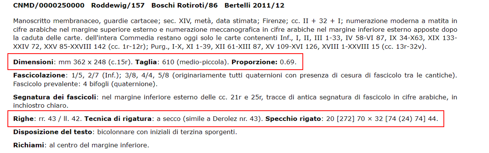
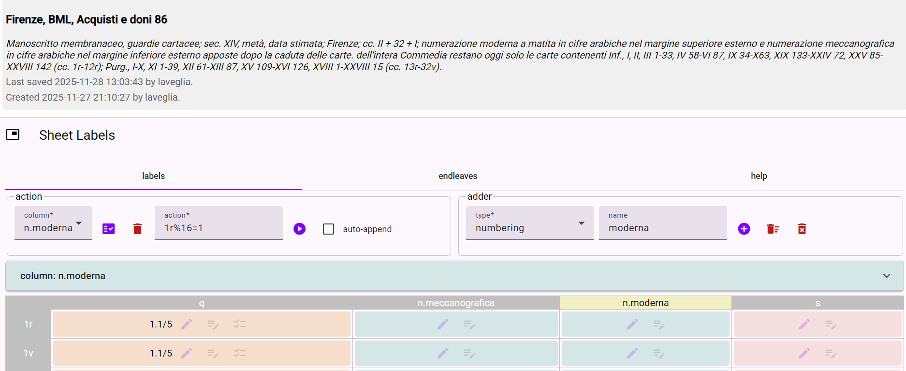
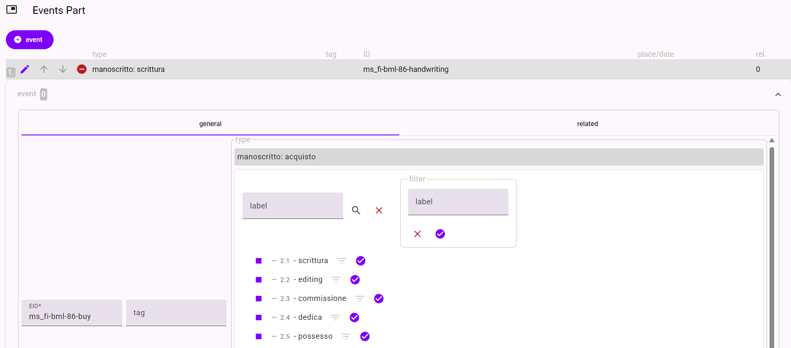

# Linee guida per il trasferimento di schede da IDP a Cadmus

>a cura di Andrea La Veglia (per chiarimenti: [alaveglia@unisa.it](mailto:alaveglia@unisa.it))

In queste linee guida saranno illustrati i passaggi per il trasferimento di una scheda di catalogo dal database di IDP all'ambiente di Cadmus.

Si utilizzerà come esempio la scheda IDP del ms. **Firenze, BML, Acquisti e doni 86** corrispondente alla scheda IDP: [ms/250000
](https://www.dante.unina.it/ms/250000).

Passaggi da seguire:

- [1.1 Aggiunta di item](#11-aggiunta-di-item)
- [1.2 Aggiunta di part](#12-aggiunta-di-part)
- [2. Descrizione codicologica](#2-descrizione-codicologica-material)
- [3. Descrizione del progetto decorativo](#3-contenuti-e-progetto-decorativo-content)    
- [4. Aggiunta della bibliografia](#4-aggiunta-della-bibliografia-references)

> NB: `IDP_...` = dopo il prefisso IDP_ è indicato il nome del campo di una tabella del database di IDP, che corrisponde nei contenuti ad un campo della scheda del ms visualizzata su dante.unina.it, con una label che talvolta ha un nome leggermente diverso, la quale anche viene indicata in **grassetto**. 

## 0. brick ricorrenti

### reference

## 1.1 Aggiunta di _item_

Cadmus è un framework di descrizione modulare, nel senso che offre la possibilità di strutturare le informazioni in moduli componibili. In particolare l'architettura di Cadmus è costituita da **_items_** e da **_parts_**.  
 
L'_item_ è come una scatola che contiene al suo interno elementi correlati tra loro e riferiti al contenitore che sono le _parts_.  
Dunque possiamo utilizzare l'_item_ per identificare un manoscritto o un'unità codicologica, la cui descrizione analitica si articolerà con l'inserimento di diverse _parts_ (Cf. [Documentazione di Cadmus](https://cadmus.fusi-soft.com/docs/data-architecture)). 

Dunque per aggiungere un ms al database di Cadmus è necessario creare un nuovo _item_, andando sul bottone in basso a sinistra nella visualizzazione dell'editor di Cadmus_NDP.

<figcaption>Aggiunta di un item in Cadmus.</figcaption>

### Metadati identificativi (identity)

Per la creazione di un nuovo _item_ bisogna inserire i seguenti metadati obbligatori che costituiscono l'etichetta (_**label**_) dell'_item_: 
- `title` che corrisponde al titolo arbitrario identificativo dell'item. Qui si deve inserire il **titolo che appare nella scheda IDP** (= `IDP_indice` = `IDP_città` + `IDP_biblioteche/nome` +`IDP_segnatura`) con abbreviazione canonica della biblioteca di riferimento. Nel caso preso ad esempio si ha quindi l'item con nome: [Firenze, BML, Acquisti e doni 86](https://cadmuslab.naplesdante.it/items/da02c76d-a0f2-4285-8622-97a286fc6102).
- `description` che consiste nella descrizione sommaria del manoscritto. Qui si deve inserire la **descrizione sintetica** della scheda IDP (`IDP_unita/descrizionesintetica`). sarebbe il primo blocco di testo che viene visualizzato .
- `facet`provvede ad indicare la tipologia di item. Nel caso del'aggiunta di un manoscritto il valore è chiaramente `manuscript`.

### Flags

I flags sono le "bandierine" che segnalano lo stato editoriale della catalogazione dell'oggetto di riferimento (ms, frg, ...) in Cadmus.

> NB Dal momento della creazione dell'item bibliologico fino al suo completamento, per segnalare agli altri contributori che è ancora in lavorazione, bisogna selezionare lo stato di `draft`. 
Dopo il completamento della scheda si potrà selezionare `complete` e togliere la spunta a `draft`.

[torna all'indice](#linee-guida-per-il-trasferimento-di-schede-da-idp-a-cadmus)

## 1.2 Aggiunta di _part_

Un elemento _part_ è un **set di dati** coerente che si riferisce all'item al quale viene correlato (Cf. [Documentazione di Cadmus](https://cadmus.fusi-soft.com/docs/data-architecture)).  
DUnque, dopo aver creato un _item_ si può procedere alla parte fondamentale del lavoro, ossia l'aggiunta delle parti di Cadmus utili a descrivere l'item bibliologico in questione.  
Si veda di seguito lo screenshot di esempio per l'aggiunta di una parte. 

<figcaption>Aggiunta di un item in Cadmus.</figcaption>

### 1.2.1 Aggiunta della part `metadata`con EID e autore

La prima part da aggiungere è `metadata` per attribuire all'_item_ un EID (ID human friedly) e le informazioni sui catalogatori

#### EID 

 L'EID è strutturato convenzionalmente secondo le seguenti parti:

1. **ms** per indicare che si tratta di un manoscritto;
2. sigla standard della città di provenienza, quindi nell'esempio **fi**;
3. sigla della biblioteca in cui il ms è contenuto, quindi nell'esempio **bml**
4. parte numerica della segnatura del manoscritto, in questo caso **86**

**1** e **2** sono separate da un underscore ( **_** ), le altre parti da un trattino intermedio ( **-** )

Quindi nell'esempio l'ID risulta: `ms_fi-bml-86`

>NB tutte le lettere sono minuscole

#### Indicazioni sull'autorialità della scheda

- `author` indica l'autore della catalogazione nell'ambiente Cadmus
- `IDP author` indica l'autore della scheda in IDP (In IDP è visualizzato in fondo alla scheda, alla voce **Autore/i della scheda (sezione IDP)** [corrisponde a `IDP_autoriIDP`])
- `IDP revisor` indica il revisore della scheda in IDP (In IDP è visualizzato in fondo alla scheda, alla voce **Revisore/i della scheda (sezione IDP)** [corrisponde a `IDP_revisoriIDP`])
- `MOL author` indica l'autore della scheda in MOL (In IDP è visualizzato in fondo alla scheda, alla voce **Autore/i della scheda (sezione MOL)** [corrisponde a `IDP_autoriMOL`])
- `MOL revisor` indica il revisore della scheda in MOL (In IDP è visualizzato in fondo alla scheda, alla voce **Revisore/i della scheda (sezione MOL)** [corrisponde a `IDP_revisoriMOL`])  

[torna all'indice](#linee-guida-per-il-trasferimento-di-schede-da-idp-a-cadmus)

## 2. Descrizione codicologica (material)

### Dimensioni e layout > `Layouts`

In Cadmus le informazioni riferite alle dimensioni fisiche della pagina e alle misure dello specchio di scrittura possono essere descritte dalla _part_ `Layouts`.   

Le dimensioni fisiche della pagina sono descritte dal campo **Dimensioni** (`IDP_dimensioni`) che è il primo dopo la descrizione generale del ms.  
Da questo campo il sistema di IDP calcola la taglia (altezza+larghezza) e la proporzione (altezza/larghezza): essendo campi derivati non vanno considerati nel processo di importazione in Cadmus.

Le informazioni riferite al layout si trovano invece dopo la fascicolazione.

<figcaption>Campi IDP riferiti a dimensioni e layout

Dunque dopo aver aggiunto la part `Layouts` in Cadmus  (cf. [1.2 Aggiunta di part](#12-aggiunta-di-part)) si può procedere secondo la seguente tabella:

| Cadmus | IDP  
|---|---|
| `sample` | carta di esempio (si trova tra parentesi in **Dimensioni**)
| `range` | range di carte cui si applica il layout (inserire laddove esplicitato nella scheda IDP)
| `rulings` | **Tecnica di rigatura**
| `derolez` | numero nella classificazione di Derolez (si trova eventualmente tra parentesi in **Tecnica di rigatura**)

#### Formula
Un po' più di attenzione merita il campo `formula`.
In questo campo vanno inseriti:
- il valore numerico delle dimensioni (nel formato altezza x larghezza [HxW]) 
- La formula dello **Specchio rigato**.  
I due valori sono separati dal segno = e ne risulta la formula così composta: 
> HxW = `IDP_specchiorigato`  

Una volta inserita la formula, è possibile generare lo schema del layout ed estrarre le singole dimensioni andando a cliccare sulla freccia verso il basso a destra di `formula` e poi andando in `dimensioni` si possono importare i singoli valori numerici.

#### Note

Le informazioni aggiuntive contenute in **Disposizione del testo** vanno aggiunte come nota.

### Fascicolazione > `Sheet Labels`

Per inserire notizie sulla fascicolazione bisogna aggiungere la part `Sheet Labels` (cf. [1.2 Aggiunta di part](#12-aggiunta-di-part)), che descrive la relazione tra le carte e i fascicoli di un codice e permette di predicare altre informazioni su ogni carta.

Il risultato finale è una "tabella" che ha in orizzontale (righe) le carte e in verticale (colonne) qualsiasi "etichettatura" della pagina.  

La guida all'utilizzo di questa parte si trova nella sezione **help**. Di seguito si riportato i passaggi principali che consiglio di seguire.

> 1. Contare le carte totali del manoscritto e generare una riga per ogni carta. Il numero si ottiene sommando le carte totali di tutti i fascicoli. Dunque con l'`adder` è possibile specificare il tipo di carta che si deve aggiungere (le carte generiche contenute in fascicoli sono del tipo _body_) e poi inserire il numero.
>> Nel ms. in questione, avendo questa formula di descrizione fascicolare: 1/5, 2/7 3/8, 4/4, 5/8, il risultato è: 5+7+8+4+8 = 32.
>
>2. Aggiungere la colonna **q** (lasciando invariato il numero totale di righe). Questa colonna dà informazioni sulla fascicolazione (q sta per "quires").
>
>3. Inserire con lo strumento `action` le informazioni sulla fascicolazione, utilizzando la seguente formula:
>> `axb=qc/d`    
>
>sostituendo così  
a = carta da cui inizia il fascicolo  
b = numero di ripetizioni (dunque il numero di eventuali fascicoli uguali ripetuti in sequenza)  
c = numero del fascicolo  
d = numero carte totali del fascicolo
>> Nel ms. in questione si possono generare dunque i fascicoli con le seguenti formule:   
>   - `1x1 = q1/5`
>   - `6x1 = q2/7`
>   - `13x1 = q3/8`
>   - `21x1 = q4/4`
>   - `24x1 = q5/8`
>4. aggiungere le eventuali altre colonne:
>- n = numerazione
>- c = richiamo
>- s = segnatura
>- r = numerazione a registro   
Per ognuna di queste colonne è possibile aggiungere una nota generica andando a selezionare la colonna in questione con il menu a tendina e cliccando sul pulsante alla destra. C'è poi la possibile di inserire una `scoped note` per ogni fascicolo.  
È possibile aggiungere anche più colonne della stessa tipologia se si disambiguano con un diverso `name`, così come nell'esempio in questione:

### Legatura

Per la legatura abbiamo a disposizione la part `Bindings`(cf. [1.2 Aggiunta di part](#12-aggiunta-di-part)). Cadmus dà la possibilità di aggiungere informazioni su più legature che si sono succedute nel tempo.

In IDP tutte le informazioni utili sono presenti in **Legatura**.

In particolare:

- `tag` selezionare dal thesaurus se l'informazione descritta è riferita ad una legatura attuale o precedente o selezionare se è assente
-`cover` indicare materiale coperta
- `board` indicre materiale assi
- `description` aggiungere la descrizione (di solito è all'inizio del campo)

[torna all'indice](#linee-guida-per-il-trasferimento-di-schede-da-idp-a-cadmus)

### Scritture e mani

Le informazioni su scritture e mani in IDP sono contenute all'interno di **Tipologia grafica** e in **Osservazioni** quando è presente la nota "Scrittura e mani"  e possono essee importate nella part `Hands`(cf. [1.2 Aggiunta di part](#12-aggiunta-di-part))

- `EID` indica un identificativo user friendly. Per gli anonimi si può procedere con Mano1, Mano2, etc. Per i copisti identificati si possono indicare convenzionalmente le prime tre lettere del nome e del cognome.
- `name` nome per esteso della mano o del copista
- `ID` = sequenza alfanumerica che rende computabile l'entità riferita alla mano. Laddove possibile è buona prassi inserire un ID di un [authority file](https://it.wikipedia.org/wiki/Controllo_di_autorit%C3%A0) esterno per una conformità con il [web semantico](https://it.wikipedia.org/wiki/Web_semantico). Selezionando "add ID" si può andare in `target`, poi spuntare `external` e in _external lookup_ selezionare MOL, che rimanda all'[authority file dell'ICCU](https://www.iccu.sbn.it/it/SBN/sbn-notizie-1998-2001/pagina_185.html).
- `instances` si può aggiungere qui la descrizione paleografica di ogni mano e il tipo di intervento. In particolare:  
        - `script`: selezionare le tipologie di scrittura riferite alla mano che si sta descrivendo e indicare il `range` di carte in cui è utilizzata.
        - `typologies`: tipo di testo prodotto

>NB fare attenzione al salvataggio dopo l'inserimento dei dati: con il segno di spunta nel cerchio blu si salvano prima i dati inseriti nel brick interno alla part e poi la part nel suo complesso.  
Nel caso in esame (`Hands`) è necessario tornare al layer generale e poi cliccare su "save".  

### Storia del manoscritto > `history` & `events`
La storia del manoscritto che in IDP è descritto analiticamente sotto la sezione **Storia del manoscritto**, in Cadmus può essere importata nelle _parts_ `history` ed `events`. Nella prima si può copiare tal quale il contenuto testuale e nella seconda si posso inserire i dati in modo razionalizzato.   

In particolare 
#### `history` (cf. [1.2 Aggiunta di part](#12-aggiunta-di-part))
Nella parte history si può riversare tal quale il contenuto di **Storia del manoscritto**.

#### `events` (cf. [1.2 Aggiunta di part](#12-aggiunta-di-part))

Questa part di Cadmus permette di aggiungere in modo razionalizzato tutti gli eventi che si sono susseguiti nella storia del codice. Partendo dalle informazioni contenute nella sezione dedicata alla storia del manoscritto si può procedere nel modo seguente.

1. aggiunta dell'`event`.
2. assegnazione di un EID. Per convenzione questo EID ha come prima parte l'EID del manoscritto stesso (in questo caso ms_fi-bml-86) e come seconda parte il nome in inglese dell'evento che si descrive. 

> **Corrispondenze italiano-inglese:**  
scrittura = handwriting  
editing = editing  
commissione = commission  
dedica = dedication  
possesso = possession  
prestito = lend  
restituzione = return  
acquisto = buy  
invio = send  
ricezione = reception  
scambio diretto = exchange  
restauro = restore   

3. selezionare con il bottone blu l'evento (si noti che dopo la selezione il nome dell'evento appare nell'header della sezione **type**).

4. aggiunta di una descrizione (**description**) sintetica dell'evento (es. Codice verosimilmente esemplato a Firenze a metà del sec. XIV).
5. aggiunta del `chronotope`, ossia della coordinata spazio-temporale aggiungendo dunque il luogo e la data dell'avvenimento.  Il `chronotope` può rimandare ad una [reference](#reference).
6. aggiunta di una ulteriore nota nell'apposito campo.

## 3. Contenuti e progetto decorativo (content)

[torna all'indice](#linee-guida-per-il-trasferimento-di-schede-da-idp-a-cadmus)

## 4. Aggiunta della bibliografia (references)

[torna all'indice](#linee-guida-per-il-trasferimento-di-schede-da-idp-a-cadmus)

