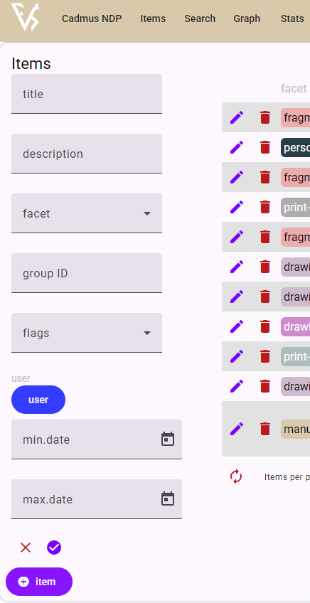
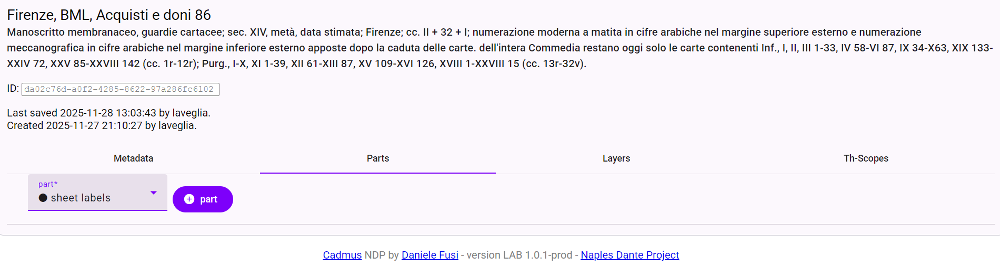

# Guida pratica all'utilizzo di Cadmus

INDICE
- [1.1 Aggiunta di item](#11-aggiunta-di-item)
- [1.2 Aggiunta di part](#12-aggiunta-di-part)

Cadmus è un framework di descrizione modulare, nel senso che offre la possibilità di strutturare le informazioni in moduli componibili. In particolare l'architettura di Cadmus è costituita da **_items_** e da **_parts_**.  

## 1. Aggiunta di un _item_

L'_item_ è come una scatola che contiene al suo interno elementi correlati tra loro e riferiti al contenitore che sono le _parts_.  
L'_item_ corrisponde ad un  manoscritto/unità codicologica, un disegno, un'edizione, un testo a stampa, un item iconografico o di una persona. La descrizione analitica dell'_item_ si articolerà tramite l'inserimento di diverse _parts_ (Cf. [Documentazione di Cadmus](https://cadmus.fusi-soft.com/docs/data-architecture)). 

Il primo passaggio per il catalogatore è dunque la creazione di un nuovo _item_, andando sul bottone in basso a sinistra nella visualizzazione dell'editor di Cadmus_NDP.

<figcaption>Aggiunta di un item in Cadmus.</figcaption>

### Metadati identificativi (identity)

Per la creazione di un nuovo _item_ bisogna inserire i seguenti metadati obbligatori che costituiscono l'etichetta (_**label**_) dell'_item_: 
- `title` 
- `description` 
- `facet`provvede ad indicare la tipologia di item, specificando dunque se si tratti di manoscritti, disegni o stampe, oppure di un item iconografico o di una persona.

### Flags

I flags sono le "bandierine" che segnalano lo stato editoriale della catalogazione dell'oggetto di riferimento (ms, frg, ...) in Cadmus.

> NB Dal momento della creazione dell'item bibliologico fino al suo completamento, per segnalare agli altri contributori che è ancora in lavorazione, bisogna selezionare lo stato di `draft`. 
Dopo il completamento della scheda si potrà selezionare `complete` e togliere la spunta a `draft`.

## 2. Aggiunta delle parts

Si riportano di seguito gli schemi di catalogazione da seguire per:
- [manoscritti](#manuscript), 

### **manuscript**

  - _identity_
    - [metadata](#23--metadata)
    - [shelfmarks]()
    - [links]()
    - [categories]() text categories are a cross-reference taxonomy used to define the text type (e.g. comment) from the philological point of view
  - _history_
    - [chronotopes]()
    - [historical events](https://github.com/vedph/cadmus-general/blob/master/docs/historical-events.md):`ms` 🚩
    - [note](https://github.com/vedph/cadmus-general/blob/master/docs/note.md):`hist` (history) 🚩
  - _material_
    - [bindings](https://github.com/vedph/cadmus-codicology/blob/master/docs/cod-bindings.md) (COD)
    - [sheet labels](https://github.com/vedph/cadmus-codicology/blob/master/docs/cod-sheet-labels.md) (COD)
    - [material description](https://github.com/vedph/cadmus-codicology/blob/master/docs/cod-material-dsc.md) (COD)
    - [watermarks](https://github.com/vedph/cadmus-codicology/blob/master/docs/cod-watermarks.md) (COD)
    - [preservation states](https://github.com/vedph/cadmus-general/blob/master/docs/physical-states.md)
  - _content_
    - [contents](https://github.com/vedph/cadmus-codicology/blob/master/docs/cod-contents.md) (COD)
    - [layouts](https://github.com/vedph/cadmus-codicology/blob/master/docs/cod-layouts.md) (COD)
    - [decorations](https://github.com/vedph/cadmus-codicology/blob/master/docs/cod-decorations.md) (COD) 🔗 `iconography`, `person`
    - [iconography instructions](https://github.com/vedph/cadmus-iconography/blob/master/docs/ico-instructions.md) (ICO) 🔗 `iconography`
    - [hands](https://github.com/vedph/cadmus-codicology/blob/master/docs/cod-hands.md) (COD) 🔗 `person`
    - [edits](https://github.com/vedph/cadmus-codicology/blob/master/docs/cod-edits.md) (COD) 🔗 `person`
    - [notable word forms](https://github.com/vedph/cadmus-ndp/blob/master/docs/notable-word-forms.md) (NDP)
  - _editorial_
    - [note](https://github.com/vedph/cadmus-general/blob/master/docs/note.md)
  - _references_
    - [references](https://github.com/vedph/cadmus-general/blob/master/docs/doc-references.md) (mostly used for Zotero bibliography)

### **fragment**

  - _identity_
    - [metadata](https://github.com/vedph/cadmus-general/blob/master/docs/metadata.md)
    - [shelfmarks](https://github.com/vedph/cadmus-codicology/blob/master/docs/cod-shelfmarks.md) (COD)
    - [links](https://github.com/vedph/cadmus-general/blob/master/docs/pin-links.md) 🔗 `manuscript` (+group)
    - [categories](https://github.com/vedph/cadmus-general/blob/master/docs/categories.md):`txt` 🚩
  - _history_
    - [chronotopes](https://github.com/vedph/cadmus-general/blob/master/docs/chronotopes.md)
    - [historical events](https://github.com/vedph/cadmus-general/blob/master/docs/historical-events.md):`fr` 🚩
    - [note](https://github.com/vedph/cadmus-general/blob/master/docs/note.md):`hist` (history)
  - _material_
    - [support](https://github.com/vedph/cadmus-ndp-frac/blob/master/docs/cod-fr-support-part.md) (FRA)
    - [rulings](https://github.com/vedph/cadmus-ndp-frac/blob/master/docs/cod-fr-rulings-part.md) (FRA)
    - [labels](https://github.com/vedph/cadmus-ndp-frac/blob/master/docs/cod-fr-quire-labels-part.md):`sig` (FRA) 🚩
    - [labels](https://github.com/vedph/cadmus-ndp-frac/blob/master/docs/cod-fr-quire-labels-part.md) (FRA)
    - [decorated counts](https://github.com/vedph/cadmus-general/blob/master/docs/decorated-counts.md):`fr` 🚩
    - [measurements](https://github.com/vedph/cadmus-general/blob/master/docs/physical-measurements.md):`fr` 🚩
    - [preservation states](https://github.com/vedph/cadmus-general/blob/master/docs/physical-states.md)
  - _content_
    - [contents](https://github.com/vedph/cadmus-codicology/blob/master/docs/cod-contents.md) (COD)
    - [layout](https://github.com/vedph/cadmus-ndp-frac#codfrlayoutpart) (FRA)
    - [decorations](https://github.com/vedph/cadmus-codicology/blob/master/docs/cod-decorations.md) (COD) 🔗 `iconography`, `person`
    - [iconography instructions](https://github.com/vedph/cadmus-iconography/blob/master/docs/ico-instructions.md) (ICO) 🔗 `iconography`
    - [hands](https://github.com/vedph/cadmus-codicology/blob/master/docs/cod-hands.md) (COD) 🔗 `person`
    - [edits](https://github.com/vedph/cadmus-codicology/blob/master/docs/cod-edits.md) (COD) 🔗 `person`
    - [notable word forms](https://github.com/vedph/cadmus-ndp/blob/master/docs/notable-word-forms.md) (NDP)
  - _editorial_
    - [note](https://github.com/vedph/cadmus-general/blob/master/docs/note.md)
  - references
    - [references](https://github.com/vedph/cadmus-general/blob/master/docs/doc-references.md)

### **print edition**

  - _identity_
    - [metadata](https://github.com/vedph/cadmus-general/blob/master/docs/metadata.md)
    - [links](https://github.com/vedph/cadmus-general/blob/master/docs/pin-links.md) (this can include also authors and editors) 🔗 `person`
    - [categories](https://github.com/vedph/cadmus-general/blob/master/docs/categories.md):`txt` 🚩
  - _history_
    - [chronotopes](https://github.com/vedph/cadmus-general/blob/master/docs/chronotopes.md):`prn` 🚩 (print date/place)
    - [chronotopes](https://github.com/vedph/cadmus-general/blob/master/docs/chronotopes.md):`pub` 🚩 (publication date/place)
  - _content_
    - [fonts](https://github.com/vedph/cadmus-ndp-books/blob/master/docs/print-fonts-part.md) (BOK)
    - [layouts](https://github.com/vedph/cadmus-codicology/blob/master/docs/cod-layouts.md) (COD)
    - [watermarks](https://github.com/vedph/cadmus-codicology/blob/master/docs/cod-watermarks.md) (COD)
    - [figurative plan](https://github.com/vedph/cadmus-ndp-books/blob/master/docs/figurative-plan-part.md) (BOK) 🔗 `person`
    - [note](https://github.com/vedph/cadmus-general/blob/master/docs/note.md):`inc` 🚩 (incipit)
    - [note](https://github.com/vedph/cadmus-general/blob/master/docs/note.md):`col` 🚩 (colophon)
  - _editorial_
    - [note](https://github.com/vedph/cadmus-general/blob/master/docs/note.md)
  - _references_
    - [references](https://github.com/vedph/cadmus-general/blob/master/docs/doc-references.md)

### **print instance**

  - _identity_
    - [metadata](https://github.com/vedph/cadmus-general/blob/master/docs/metadata.md)
    - [links](https://github.com/vedph/cadmus-general/blob/master/docs/pin-links.md) 🔗 `print edition` (+group)
    - [shelfmarks](https://github.com/vedph/cadmus-codicology/blob/master/docs/cod-shelfmarks.md)
    - [categories](https://github.com/vedph/cadmus-general/blob/master/docs/categories.md):`txt` 🚩
  - _history_
    - [historical events](https://github.com/vedph/cadmus-general/blob/master/docs/historical-events.md):`pri` 🚩
    - [note](https://github.com/vedph/cadmus-general/blob/master/docs/note.md):`hist` 🚩 (history)
  - _material_
    - [bindings](https://github.com/vedph/cadmus-codicology/blob/master/docs/cod-bindings.md) (COD)
    - [sheet labels](https://github.com/vedph/cadmus-codicology/blob/master/docs/cod-sheet-labels.md) (COD)
    - [measurements](https://github.com/vedph/cadmus-general/blob/master/docs/physical-measurements.md):`pri`
    - [preservation states](https://github.com/vedph/cadmus-general/blob/master/docs/physical-states.md)
  - _content_
    - [layouts](https://github.com/vedph/cadmus-codicology/blob/master/docs/cod-layouts.md) (COD)
    - [figurative plan implementation](https://github.com/vedph/cadmus-ndp-books/blob/master/docs/figurative-plan-impl-part.md) (BOK) 🔗 `iconography`
    - [decorations](https://github.com/vedph/cadmus-codicology/blob/master/docs/cod-decorations.md) (COD) 🔗 `iconography`, `person`
    - [edits](https://github.com/vedph/cadmus-codicology/blob/master/docs/cod-edits.md) (COD)
    - [notable word forms](https://github.com/vedph/cadmus-ndp/blob/master/docs/notable-word-forms.md) (NDP)
  - _editorial_
    - [note](https://github.com/vedph/cadmus-general/blob/master/docs/note.md)
  - _references_
    - [references](https://github.com/vedph/cadmus-general/blob/master/docs/doc-references.md)

### **drawings project**

  - _identity_
    - [metadata](https://github.com/vedph/cadmus-general/blob/master/docs/metadata.md)
    - [links](https://github.com/vedph/cadmus-general/blob/master/docs/pin-links.md) (also for authors) 🔗 `person`
    - [shelfmarks](https://github.com/vedph/cadmus-codicology/blob/master/docs/cod-shelfmarks.md) (COD)
  - _history_
    - [chronotopes](https://github.com/vedph/cadmus-general/blob/master/docs/chronotopes.md)
    - [historical events](https://github.com/vedph/cadmus-general/blob/master/docs/historical-events.md):`drp` 🚩
    - [note](https://github.com/vedph/cadmus-general/blob/master/docs/note.md):`hist` 🚩 (history)
  - _material_
    - [bindings](https://github.com/vedph/cadmus-codicology/blob/master/docs/cod-bindings.md):`drp` 🚩 (COD)
    - [preservation states](https://github.com/vedph/cadmus-general/blob/master/docs/physical-states.md)
    - [decorated counts](https://github.com/vedph/cadmus-general/blob/master/docs/decorated-counts.md):`drp` 🚩
  - _content_
    - [comment](https://github.com/vedph/cadmus-general/blob/master/docs/comment.md)
  - _editorial_
    - [note](https://github.com/vedph/cadmus-general/blob/master/docs/note.md)
  - _references_
    - [references](https://github.com/vedph/cadmus-general/blob/master/docs/doc-references.md)

### **drawing item**

  - _identity_
    - [metadata](https://github.com/vedph/cadmus-general/blob/master/docs/metadata.md)
    - [links](https://github.com/vedph/cadmus-general/blob/master/docs/pin-links.md) (also for authors) 🔗 `drawings project` (+group) 🔗 `person`
    - [shelfmarks](https://github.com/vedph/cadmus-codicology/blob/master/docs/cod-shelfmarks.md) (COD)
  - _history_
    - [chronotopes](https://github.com/vedph/cadmus-general/blob/master/docs/chronotopes.md)
    - [historical events](https://github.com/vedph/cadmus-general/blob/master/docs/historical-events.md):`dri` 🚩
    - [note](https://github.com/vedph/cadmus-general/blob/master/docs/note.md):`hist` 🚩 (history)
  - _material_
    - [drawing tech](https://github.com/vedph/cadmus-ndp-drawings?tab=readme-ov-file#drawingtechpart) (DRW)
    - [watermarks](https://github.com/vedph/cadmus-codicology/blob/master/docs/cod-watermarks.md) (COD)
    - [preservation states](https://github.com/vedph/cadmus-general/blob/master/docs/physical-states.md)
  - _content_
    - [flags](https://github.com/vedph/cadmus-general/blob/master/docs/flags.md):`dri` 🚩
    - [edits](https://github.com/vedph/cadmus-codicology/blob/master/docs/cod-edits.md) (COD)
    - [iconography instructions](https://github.com/vedph/cadmus-iconography/blob/master/docs/ico-instructions.md) (ICO) 🔗 `iconography`
  - _editorial_
    - [note](https://github.com/vedph/cadmus-general/blob/master/docs/note.md)
  - _references_
    - [references](https://github.com/vedph/cadmus-general/blob/master/docs/doc-references.md)

### **iconography**

  - _identity_
    - [metadata](https://github.com/vedph/cadmus-general/blob/master/docs/metadata.md)
  - _relations_
    - [links](https://github.com/vedph/cadmus-general/blob/master/docs/pin-links.md) 🔗 `iconography`
    - [categories](https://github.com/vedph/cadmus-general/blob/master/docs/categories.md):`ict` 🚩 (iconographic topics = IDP categorie)
    - [note](https://github.com/vedph/cadmus-general/blob/master/docs/note.md):`isd` 🚩 (subject details = IDP rapporti con la tradizione dantesca)
    - [categories](https://github.com/vedph/cadmus-general/blob/master/docs/categories.md):`ics` 🚩 (iconographic subjects = IDP soggetti)
    - [categories](https://github.com/vedph/cadmus-general/blob/master/docs/categories.md):`ctx` 🚩 (luoghi danteschi)
  - _content_
    - [flags](https://github.com/vedph/cadmus-general/blob/master/docs/flags.md):`ico` 🚩 (storie seconde, altro)
    - [comment](https://github.com/vedph/cadmus-general/blob/master/docs/comment.md) (description, including keywords)
    - [note](https://github.com/vedph/cadmus-general/blob/master/docs/note.md):`ptx` (paratext)
    - [note](https://github.com/vedph/cadmus-general/blob/master/docs/note.md):`exe` (exegesis)
    - [note](https://github.com/vedph/cadmus-general/blob/master/docs/note.md):`ift` 🚩 (figurative theme = IDP rapporti extradanteschi)
    - [note](https://github.com/vedph/cadmus-general/blob/master/docs/note.md):`msc` 🚩 (miscellaneous = IDP note)
  - _editorial_
    - [note](https://github.com/vedph/cadmus-general/blob/master/docs/note.md)
  - _references_
    - [references](https://github.com/vedph/cadmus-general/blob/master/docs/doc-references.md)

### **person**
  - _identity_
    - [metadata](https://github.com/vedph/cadmus-general/blob/master/docs/metadata.md)
    - [names](https://github.com/vedph/cadmus-general/blob/master/docs/names.md)
    - [categories](https://github.com/vedph/cadmus-general/blob/master/docs/categories.md):`bio` 🚩 (person categories, like poet, cardinal, jurist, miniaturist, etc.)
    - [links](https://github.com/vedph/cadmus-general/blob/master/docs/pin-links.md)
  - _history_
    - [historical events](https://github.com/vedph/cadmus-general/blob/master/docs/historical-events.md):`bio` 🚩
    - [note](https://github.com/vedph/cadmus-general/blob/master/docs/note.md):`hist` 🚩 (history)
  - _editorial_
    - [note](https://github.com/vedph/cadmus-general/blob/master/docs/note.md)
  - _references_
    - [references](https://github.com/vedph/cadmus-general/blob/master/docs/doc-references.md)

## 2.2 Come si aggiunge una _part_

Un elemento _part_ è un **set di dati** coerente che si riferisce all'item al quale viene correlato (Cf. [Documentazione di Cadmus](https://cadmus.fusi-soft.com/docs/data-architecture)).  
DUnque, dopo aver creato un _item_ si può procedere alla parte fondamentale del lavoro, ossia l'aggiunta delle parti di Cadmus utili a descrivere l'item bibliologico in questione.  
Si veda di seguito lo screenshot di esempio per l'aggiunta di una parte. 

<figcaption>Aggiunta di un item in Cadmus.</figcaption>

## 2.3  `metadata`

La prima part da aggiungere è `metadata` per attribuire all'_item_ un EID (ID human friedly) e le informazioni sui catalogatori

### EID 

 L'EID è strutturato convenzionalmente secondo le seguenti parti:

1. indica il *facet* 
2. sigla standard della città di provenienza o di edizione;
3. sigla della biblioteca o archivio in cui è contenuto il manufatto da descrivere; 
4. parte numerica della segnatura del manoscritto o dell'incunabolo 

**1** e **2** sono separate da un underscore ( **_** ), le altre parti da un trattino intermedio ( **-** )

Quindi nel caso del manoscritto mediceo l'EID risulta: `ms_fi-bml-86`

>NB tutte le lettere sono minuscole

### Indicazioni sull'autorialità della scheda

- `author` indica l'autore della catalogazione nell'ambiente Cadmus nel caso in cui abbia fatto un lavoro di catalogazione  "di prima mano"
- `revisor` indica l'autore della catalogazione nell'ambiente Cadmus nel caso in cui abbia fatto un lavoro di catalogazione  "di seconda mano"
- `IDP author` indica l'autore della scheda in IDP (In IDP è visualizzato in fondo alla scheda, alla voce **Autore/i della scheda (sezione IDP)** [corrisponde a `IDP_autoriIDP`])
- `IDP revisor` indica il revisore della scheda in IDP (In IDP è visualizzato in fondo alla scheda, alla voce **Revisore/i della scheda (sezione IDP)** [corrisponde a `IDP_revisoriIDP`])
- `MOL author` indica l'autore della scheda in MOL (In IDP è visualizzato in fondo alla scheda, alla voce **Autore/i della scheda (sezione MOL)** [corrisponde a `IDP_autoriMOL`])
- `MOL revisor` indica il revisore della scheda in MOL (In IDP è visualizzato in fondo alla scheda, alla voce **Revisore/i della scheda (sezione MOL)** [corrisponde a `IDP_revisoriMOL`])  

[torna all'indice](#linee-guida-per-il-trasferimento-di-schede-da-idp-a-cadmus)

## 4. Aggiunta della bibliografia (references)

[torna all'indice](#linee-guida-per-il-trasferimento-di-schede-da-idp-a-cadmus)

