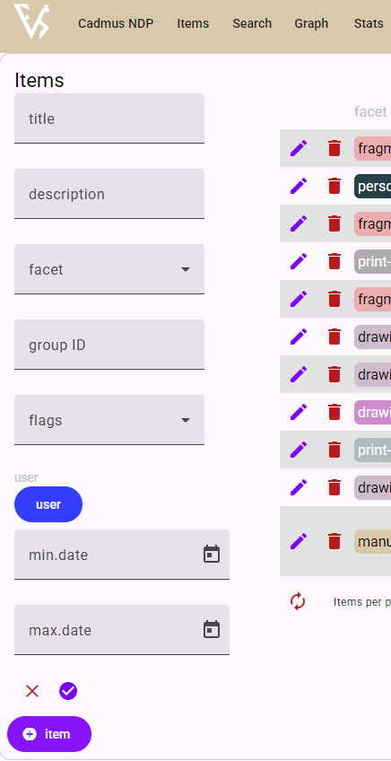
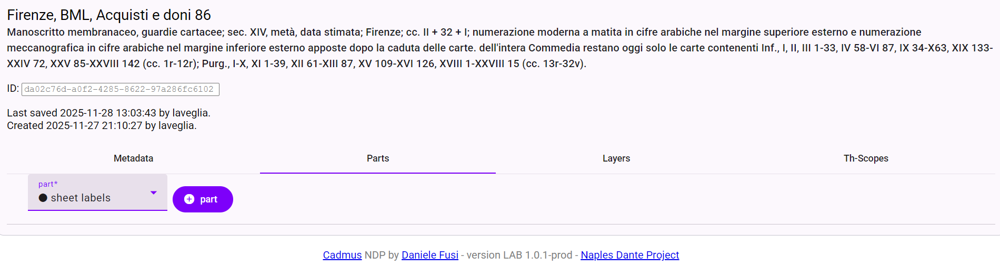
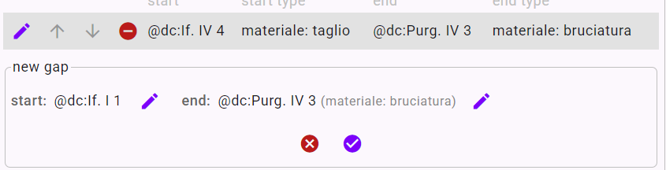
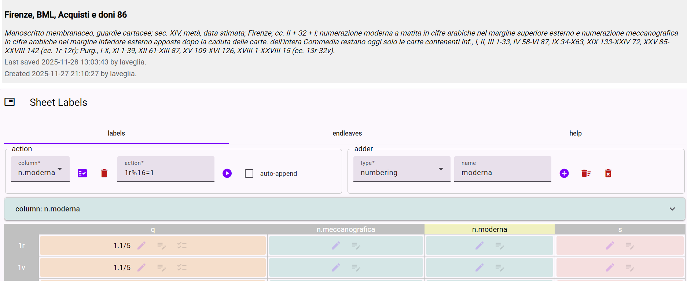

# Guida pratica all'utilizzo di NDP Cadmus

>a cura di Andrea La Veglia (per chiarimenti: [alaveglia@unisa.it](mailto:alaveglia@unisa.it))

INDICE
- [1 Aggiunta di item](#1-aggiunta-di-un-item)
- [2 Aggiunta di part](#2-aggiunta-delle-parts)

Cadmus è un framework di descrizione modulare, nel senso che offre la possibilità di strutturare le informazioni in moduli componibili. In particolare l'architettura di Cadmus è costituita da **_items_** e da **_parts_**.  

## 1. Aggiunta di un _item_

L'_item_ è come una scatola che contiene al suo interno un numero variable di  _parts_, elementi correlati tra loro e riferiti al loro contenitore.  
L'_item_ corrisponde ad un  manoscritto/unità codicologica, un disegno, un'edizione, un testo a stampa, un item iconografico o ad una persona. La descrizione analitica dell'_item_ si articolerà tramite l'inserimento di diverse _parts_ (Cf. [Documentazione online di Cadmus](https://myrmex.github.io/overview/cadmus/dev/models/)). 

Il primo passaggio per il catalogatore è dunque la creazione di un nuovo _item_, andando sul bottone in basso a sinistra nella visualizzazione dell'editor di Cadmus_NDP.

<figcaption>Aggiunta di un item in Cadmus.</figcaption>

### Metadati identificativi (identity)

Per la creazione di un nuovo _item_ bisogna inserire i seguenti metadati obbligatori che costituiscono l'etichetta (_**label**_) dell'_item_: 
- `title` = indica il titolo rappresentativo dell'item. A seconda del tipo di item si seguiranno queste convenzioni stabilite
  - **manoscritto**: Città secondo la lingua del catalogo, abbreviazione della biblioteca, secondo le [abbreviazioni di cui alla tabella in appendice](#abbreviazioni-biblioteche), segnatura.
- `description` 
- `facet`provvede ad indicare la tipologia di item, specificando dunque se si tratti di manoscritti, disegni o stampe, oppure di un item iconografico o di una persona.

### Flags

I flags sono le "bandierine" che segnalano lo stato editoriale della catalogazione dell'oggetto di riferimento (ms, frg, ...) in Cadmus.

> NB Dal momento della creazione dell'item bibliologico fino al suo completamento, per segnalare agli altri contributori che è ancora in lavorazione, bisogna selezionare lo stato di `draft`. 
Dopo il completamento della scheda si potrà selezionare `complete` e togliere la spunta a `draft`.

## 2. Aggiunta delle _parts_

Dopo aver creato l'_item_, ossia la "scatola" che rappresenta l'oggetto che si sta catalogando, si può procedere all'aggiunta delle parti di Cadmus utili a descrivere l'oggetto in questione.  

L' elemento _part_ è un **set di dati** coerente che si riferisce all'item al quale viene correlato (Cf. [Documentazione di Cadmus](https://cadmus.fusi-soft.com/docs/data-architecture)).  
Si veda di seguito lo screenshot di esempio per l'aggiunta di una parte. 

<figcaption>Aggiunta di una part in Cadmus.</figcaption>

In Cadmus per ogni tipologia di oggetto è stato predisposto un modello descrittivo/interpretativo che suggerisce l'utilizzo di specifiche parts.

>AVVERTENZA GENERALE: per ogni part ci sono dei campi obbligatori indicati con l'asterisco (*): se non vengono compilati, come segnalerà il messsaggio di errore, risulterà impossibile salvare la part.

Si riportano di seguito gli schemi di catalogazione da seguire per:
- [manoscritti](#manuscript), 
- [frammenti](#fragment)
- [edizioni di testi a stampa (edizione "ideale")](#print-edition)
- [esemplare di testo a stampa](#print-instance)
- [progetto dei disegni](#drawings-project)
- [disegno](#drawing-item)
- [iconografia](#iconography)
- [persona](#person)

### **manuscript**

  - _identity_
    - [metadata](#metadata)
    - [shelfmarks](#shelfmarks)
    - [links](#links)
    - [categories](#categories)  
  - _history_
    - [chronotopes](#chronotopes)
    - [historical events](#historical-events)
    - [note](#note)
  - _material_
    - [bindings](#bindings)
    - [sheet labels](#sheet-labels)
    - [material description](#material-description) 
    - [watermarks](#watermarks)
    - [preservation states](#preservation-states)
  - _content_
    - [contents](#contents)
    - [layouts](#layouts)
    - [decorations](#decorations)
    - [iconography instructions](#iconography-instructions) 
    - [hands](#hands)
    - [edits](#edits)
    - [notable word forms](#notable-word-forms) 
  - _editorial_
    - [note](#note)
  - _references_
    - [references](#references) (mostly used for Zotero bibliography)

### **fragment**

  - _identity_
    - [metadata](#metadata)
    - [shelfmarks](#shelfmarks)
    - [links](#links)
    - [categories](#categories)  
  - _history_
    - [chronotopes](#chronotopes)
    - [historical events](#historical-events)
    - [note](#note)
  - _material_
    - [support](#support)
    - [rulings](#rulings)
    - [labels](#labels)
    - [decorated counts](#decorated-counts)
    - [measurements](#measurements)
    - [preservation states](#preservation-states)
  - _content_
    - [contents](#contents)
    - [layout](#layout)
    - [decorations](#decorations)
    - [iconography instructions](#iconography-instructions)
    - [hands](#hands)
    - [edits](#edits)
    - [notable word forms](#notable-word-forms)
  - _editorial_
    - [note](#note)
  - _references_
    - [references](#references)

### **print edition**

  - _identity_
    - [metadata](#metadata)
    - [links](#links)
    - [categories](#categories)  
  - _history_
    - [chronotopes](#chronotopes)
  - _content_
    - [fonts](#fonts)
    - [layouts](#layouts)
    - [watermarks](#watermarks)
    - [figurative plan](#figurative-plan)
    - [note](#note)
  - _editorial_
    - [note](#note)
  - _references_
    - [references](#references)

### **print instance**

  - _identity_
    - [metadata](#metadata)
    - [links](#links)
    - [shelfmarks](#shelfmarks)
    - [categories](#categories)  
  - _history_
    - [historical events](#historical-events)
    - [note](#note)
  - _material_
    - [bindings](#bindings)
    - [sheet labels](#sheet-labels)
    - [measurements](#measurements)
    - [preservation states](#preservation-states)
  - _content_
    - [layouts](#layouts)
    - [figurative plan implementation](#figurative-plan-implementation)
    - [decorations](#decorations)
    - [edits](#edits)
    - [notable word forms](#notable-word-forms)
  - _editorial_
    - [note](#note)
  - _references_
    - [references](#references)

### **drawings project**

  - _identity_
    - [metadata](#metadata)
    - [links](#links)
    - [shelfmarks](#shelfmarks)
  - _history_
    - [chronotopes](#chronotopes)
    - [historical events](#historical-events)
    - [note](#note)
  - _material_
    - [bindings](#bindings)
    - [preservation states](#preservation-states)
    - [decorated counts](#decorated-counts)
  - _content_
    - [comment](#comment)
  - _editorial_
    - [note](#note)
  - _references_
    - [references](#references)

### **drawing item**

  - _identity_
    - [metadata](#metadata)
    - [links](#links)
    - [shelfmarks](#shelfmarks)
  - _history_
    - [chronotopes](#chronotopes)
    - [historical events](#historical-events)
    - [note](#note)
  - _material_
    - [drawing tech](#drawing-tech)
    - [watermarks](#watermarks)
    - [preservation states](#preservation-states)
  - _content_
    - [flags](#flags)
    - [edits](#edits)
    - [iconography instructions](#iconography-instructions)
  - _editorial_
    - [note](#note)
  - _references_
    - [references](#references)

### **iconography**

  - _identity_
    - [metadata](#metadata)
  - _relations_
    - [links](#links)
    - [categories](#categories)
    - [note](#note)
  - _content_
    - [flags](#flags)
    - [comment](#comment)
    - [note](#note)
  - _editorial_
    - [note](#note)
  - _references_
    - [references](#references)

### **person**

  - _identity_
    - [metadata](#metadata)
    - [names](#names)
    - [categories](#categories)
    - [links](#links)
  - _history_
    - [historical events](#historical-events)
    - [note](#note)
  - _editorial_
    - [note](#note)
  - _references_
    - [references](#references)

## 3 Elenco analitico (in ordine alfabetico) delle part
Di seguito si riportano in ordine alfabetico le parts di CADMUS NDP (che sono richiamate nelle singole sezioni dedicate ad ogni items). All'intero di ogni part si ritrovano dei _bricks_ che servono ad inserire una tipologia ancora più specifica di dato. Per l'elenco analitico dei bricks, si rimanda alla sezione successiva, ma ogni brick è richiamato all'interno delle parts in cui è implementato.
Cf. https://github.com/vedph/cadmus-ndp-api

### bindings
### categories
text categories are a cross-reference taxonomy used to define the text type (e.g. comment) from the philological point of view
### chronotopes
In questa part si possono aggiungere diverse coordinate crono-spaziali con il brick [chronotope](#cadmusrefschronotope).
### contents
#### gaps
La sezione "gaps" è utile per aggiungere l'indicazione delle lacune. 
Per l'aggiunta di ogni lacuna si seguando tali passaggi:
1. si aggiunge una lacuna con il bottone gap
2. in seguito l'editor mostra "start" e "end": due campi che indicano l'inizio e la fine della lacuna nel testo. Per ognuno dei due campi si clicca sull'icona della matita e si indica:  
  (a) il tipo di lacuna (type)    
  (b) parziale/completa   
  (c) il verso di inizio/fine della lacuna: per indicarlo si usa il brick [Citation](#cadmusrefscitation)
      Si può aggiungere una nota se si ritiene utile.
4. dopo aver compilato correttamente i campi "start" e "end" e l'eventuale nota  si può salvare la lacuna con il bottone blu con la spunta in basso. Nell'immagine può vedere come le appare prima di salvare (in basso) e dopo il salvataggio (in alto).
<figcaption>Esempio di lacuna aggiunta</figcaption>
### decorations
### edits
### hands
### historical events
### iconography instructions
### layouts
Questa part dàinformazioni sulle dimensioni fisiche della pagina le misure dello specchio di scrittura.   

Di seguito le informazioni utili per compilare i campi di questa part.

| campo | descrizione|
|---|---|
| `sample` | carta di esempio
| `range` | range di carte a cui si applica il layout
| `rulings` | Tecnica di rigatura
| `derolez` | numero nella classificazione di Derolez

#### Formula
Un po' più di attenzione merita il campo `formula`.
In questo campo vanno inseriti:
- il valore numerico delle dimensioni (nel formato altezza x larghezza [HxW]) 
- La formula dello **Specchio rigato**.  
I due valori sono separati dal segno = e ne risulta la formula così composta:  

Una volta inserita la formula, è possibile generare lo schema del layout ed estrarre le singole dimensioni andando a cliccare sulla freccia verso il basso a destra di `formula` e poi andando in `dimensioni` si possono importare i singoli valori numerici.

#### Note

Le informazioni aggiuntive contenute in **Disposizione del testo** vanno aggiunte come nota.
### links
### material description
### metadata
Con questa parte si attribuiscono all'item dei metadati generici.  
Convenzionalmente qui si deve inserire un [EID](<#definizione-ed-elaborazione-di-un-eid>) e le informazioni e le informazioni sull'autorialità della scheda
Ogni metadato ha un campo *type* che indica il [tipo di dato](#tipi-di-dato) un campo *name* per indicare la classe di 

#### name=EID 

Leggere preliminarmente le informazioni per [definizione ed elaborazione di EID](<#definizione-ed-elaborazione-di-un-eid>)

1. indica il *facet*, ossia la tipologia di item secondo la seguente tabella

| facet | abbreviazione per EID |
|---|---|
| manoscritto | ms |
| testo a stampa | inc/stamp |
| edizione | ed |
| frammento | fr |
| iconografia | ... |

2. sigla standard della città di provenienza o di edizione;
3. sigla della biblioteca o archivio in cui è contenuto il manufatto da descrivere, utilizzando le [abbreviazioni](#abbreviazioni-biblioteche) stabilite convenzionalmente; 
4. abbreviazione della parte letterale della segnatura
5. parte numerica della segnatura del manoscritto o dell'incunabolo 

**1** e **2** sono separate da un underscore ( **_** ), le altre parti da un trattino intermedio ( **-** )

Quindi nel caso del manoscritto mediceo l'EID risulta: `ms_fi-bml-aed-86`

>NB tutte le lettere sono minuscole
#### Autorialità della scheda
#### `author` 
indica l'autore della catalogazione nell'ambiente Cadmus nel caso in cui abbia fatto un lavoro di catalogazione  "di prima mano"
#### `revisor` 
indica l'autore della catalogazione nell'ambiente Cadmus nel caso in cui abbia fatto un lavoro di catalogazione  "di seconda mano" 
### notable word forms
### note
### preservation states
### references
### sheet labels
 Questa part descrive la relazione tra le carte e i fascicoli di un codice e permette di predicare altre informazioni su ogni carta.

Il risultato finale è una "tabella" che ha in orizzontale (righe) le carte e in verticale (colonne) qualsiasi "etichettatura" della pagina.  

La guida all'utilizzo di questa parte si trova nella sezione **help**. Di seguito si riportato i passaggi principali che consiglio di seguire.

> 1. Contare le carte totali del manoscritto e generare una riga per ogni carta. Il numero si ottiene sommando le carte totali di tutti i fascicoli. Dunque con l'`adder` è possibile specificare il tipo di carta che si deve aggiungere (le carte generiche contenute in fascicoli sono del tipo _body_) e poi inserire il numero.
>> Nel ms. in questione, avendo questa formula di descrizione fascicolare: 1/5, 2/7 3/8, 4/4, 5/8, il risultato è: 5+7+8+4+8 = 32.
>
>2. Aggiungere la colonna **q** (lasciando invariato il numero totale di righe). Questa colonna dà informazioni sulla fascicolazione (q sta per "quires").
>
>3. Inserire con lo strumento `action` le informazioni sulla fascicolazione, utilizzando la seguente formula:
>> `axb=qc/d`    
>
>sostituendo così  
a = carta da cui inizia il fascicolo  
b = numero di ripetizioni (dunque il numero di eventuali fascicoli uguali ripetuti in sequenza)  
c = numero del fascicolo  
d = numero carte totali del fascicolo
>> Nel ms. in questione si possono generare dunque i fascicoli con le seguenti formule:   
>   - `1x1 = q1/5`
>   - `6x1 = q2/7`
>   - `13x1 = q3/8`
>   - `21x1 = q4/4`
>   - `24x1 = q5/8`
>4. aggiungere le eventuali altre colonne:
>- n = numerazione
>- c = richiamo
>- s = segnatura
>- r = numerazione a registro   
Per ognuna di queste colonne è possibile aggiungere una nota generica andando a selezionare la colonna in questione con il menu a tendina e cliccando sul pulsante alla destra. C'è poi la possibile di inserire una `scoped note` per ogni fascicolo.  
È possibile aggiungere anche più colonne della stessa tipologia se si disambiguano con un diverso `name`, così come nell'esempio in questione:

### watermarks
cf. 
## 4. Elenco analitico (in ordine alfabetico) dei bricks
cf. https://github.com/vedph/cadmus-bricks-shell-v3#references ; https://cadmus-bricks-v3.fusi-soft.com/home .
#### assertions
L'asserzione è quell'informazione che ci permette di attribuire una data o un luogo ad un evento.
L'assertion può rimandare ad una [reference](#cadmusrefsdocreferences).
##### AssertedData
L'assertion della data può riferirsi ad una citazione -> [citation](#cadmusrefscitation)
##### AssertedPlace
### CadmusRefsChronotope
Il brick chronotope permette di aggiungere le coordinate cronospaziali di un evento.
Il cronotopo è composto da una data e/o da un luogo. 
- per aggiungere il luogo si spunta "place" e poi si scrive il luogo secondo le convenzioni decise dal gruppo di ricerca.
- la data è composta da:
    - value: anno (positivo/negativo a seconda che sia a.C. o d.C.)
    - slide: il "delta" che si può indicare per indicare un'oscillazione tra due anni nel caso in cui non ci sia sicurezza (oppure nel caso in cui l'anno antico intersechi due anni gregoriani)
    - mese
    - giorno
    - hint: una breve nota esplicativa utilizzata per chiarire o motivare meglio il dato cronologico.
- Se si vuole inserire un intervallo temporale si accende lo switch "A-B" e si inserisce la seconda data "estremo".
Si ricordi di salvare ad ogni passaggio l'informazione inserita cliccando sul bottone tondo blu con la spunta centrale.
Per la data e per il luogo si può indicare un'assertion.
### CadmusRefsCitation
https://github.com/vedph/cadmus-bricks-shell-v3/blob/master/projects/myrmidon/cadmus-refs-citation/README.md
I. Andando sulla freccia verso il basso si può utilizzare il "picker" che permette di selezionare cantica, canto e verso. Si seleziona ogni parte e si convalida con la spunta blu. Una volta inserito anche il verso si salva tutto il riferimento con la spunta blu in basso 
II. si può inserire digitando direttamente nel campo "citation"  scrivendo "@dc:" (indica che si tratta della Divina Commedia) seguito dall'indicazione standard della cantica puntata, seguita da spazio, il numero romano per il campo e il numero per il verso.
### CadmusRefsDocReferences
La reference è un rimando ad una fonte esterna che supporta una determinata asserzione. Si può selezionare una L'assertion della data può riferirsi ad una citazione -> [citation](#cadmusrefscitation) o un -> [lookup](#lookup)
### Lookup
Il lookup è un servizio che rimanda ad una reference esterna tramite un identificativo univoco. Si selezione tramite picker il "provider", ossia la fonte esterna del dato a cui ci si vuol riferire e poi con "entity" si cerca il dato stesso.
Attualmente i servizi di lookup forniti sono: 
- Zotero: servizio di bibliografia
- Biblissima+: database in mediawiki che contiene un grande corpus di dati riferiti a codicologia e storia dell'arte.
- VIAF: archivio internazionale virtuale che combina i controlli di autorità di numerose biblioteche nazionali e istituzioni nel mondo in un unico servizio online
- MOL: "Manus Online", archivio di manoscritti gestito dall'Istituto Centrale per il Catalogo Unico.
## 5. APPENDICI
### Abbreviazioni biblioteche
Se una biblioteca non è presente si prega di segnalarlo via email in modo che si possa poi stabilire una sigla convenzionale e univoca all'interno del progetto.
| Città                        | Biblioteca                                                                 | Sigla  |
|-------------------------------|---------------------------------------------------------------------------|--------|
| Ascoli Piceno                 | Biblioteca comunale                                                        | BCom   |
| Belluno                       | Biblioteca capitolare Lolliniana                                           | BL     |
| Bergamo                       | Biblioteca civica Angelo Mai                                               | BCiv   |
| Berlin                        | Staatlichen Museen, Kupferstichkabinett u. Sammlung der Zeichnungen       | StMu   |
| Berlin                        | Staatsbibliothek Preussischer Kulturbesitz                                 | SB     |
| Bologna                       | Biblioteca comunale dell'Archiginnasio                                     | BCom   |
| Bologna                       | Biblioteca universitaria                                                   | BU     |
| Boston                        | Isabella Stewart Gardner Museum                                            | ISGM   |
| Brescia                       | Biblioteca civica Queriniana                                               | BCiv   |
| Budapest                      | Eötvös Loránd Tudomány Egyetem Könyvtára                                   | ELTEK  |
| Cagliari                      | Biblioteca universitaria                                                   | BU     |
| Cambridge                     | University Library                                                         | UB     |
| Cambridge (Mass., USA)        | Harvard College Libraries, Houghton Library                                | HL     |
| Capetown                      | National Library of South Africa                                           | NLSA   |
| Chantilly                     | Bibliothèque du château                                                    | BdC    |
| Chiavari                      | Archivio Notarile                                                         | AN     |
| Città del Vaticano            | Biblioteca Apostolica Vaticana                                             | BAV    |
| Cologny                       | Fondation Martin Bodmer                                                   | FMB    |
| Cortona                       | Biblioteca Comunale e dell'Accademia Etrusca                               | BCom   |
| Crema                         | Biblioteca Comunale                                                        | BCom   |
| Eton                          | College Library                                                           | CL     |
| Firenze                       | Biblioteca Medicea Laurenziana                                             | BML    |
| Firenze                       | Biblioteca Nazionale Centrale                                              | BNCF   |
| Firenze                       | Biblioteca Riccardiana                                                    | BR     |
| Frankfurt am Main             | Stadt und Universaitäts-Bibliothek                                        | SUB    |
| Genova                        | Biblioteca Durazzo                                                        | BDur   |
| Hamburg (Altona)              | Schulbibliothek des Christianeum                                           | BC     |
| Imola                         | Biblioteca Comunale                                                        | BCom   |
| København                     | Kongelige Bibliotek                                                       | KB     |
| London                        | British Library                                                           | BL     |
| Madrid                        | Biblioteca Nacional de España                                             | BN     |
| Manchester                    | John Rylands University Library                                           | UB     |
| Milano                        | Veneranda Biblioteca Ambrosiana                                            | VBA    |
| Milano                        | Biblioteca Nazionale Braidense                                             | BNB    |
| Milano                        | Biblioteca dell'Archivio Storico e Trivulziana                             | BT     |
| Modena                        | Biblioteca Estense Universitaria                                           | BU     |
| Mumbai                        | The Asiatic Society of Mumbai                                             | ASM    |
| Napoli                        | Biblioteca Nazionale                                                       | BN     |
| Napoli                        | Biblioteca Oratoriana del Monumento Nazionale dei Girolamini di Napoli     | BOG    |
| New Haven                     | Beinecke Library (Yale University)                                        | BL     |
| New York                      | H.P. Kraus                                                                | Kraus  |
| New York                      | Morgan Library & Museum                                                   | ML     |
| Novara                        | Biblioteca Comunale                                                        | BCom   |
| Oxford                        | Bodleian Library                                                          | BL     |
| Padova                        | Biblioteca Civica                                                         | BCiv   |
| Padova                        | Biblioteca del Seminario Vescovile                                        | BSem   |
| Paris                         | Bibliothèque nationale de France (Arsenal)                                 | BnFArs |
| Paris                         | Bibliothèque nationale de France (Richelieu)                               | BnF    |
| Parma                         | Biblioteca Palatina                                                       | BPal   |
| Perugia                       | Biblioteca Comunale Augusta                                               | BCom   |
| Piacenza                      | Biblioteca Comunale Passerini Landi                                        | BCom   |
| Ravenna                       | Biblioteca Comunale Classense                                             | BCom   |
| Reggio Emilia                  | Archivio di Stato                                                         | AS     |
| Rimini                        | Biblioteca Civica Gambalunga                                              | BCiv   |
| Roma                          | Biblioteca Angelica                                                       | BA     |
| Roma                          | Biblioteca Casanatense                                                    | Bcas   |
| Roma                          | Biblioteca dell'Accademia Nazionale dei Lincei e Corsiniana               | BANLC  |
| Roma                          | Biblioteca Nazionale Centrale                                             | BNC    |
| San Daniele del Friuli         | ...                                                                       | ...    |
### Concetti e indicazioni utili ricorrenti
####  Tipi di dato
In informatica è importante definire per ogni dato la sua [tipologia](https://it.wikipedia.org/wiki/Tipo_di_dato) per consentire all'elaboratore di processarlo ed eseguire operazioni. Questo passaggio è molto importante, poiché se, ad esempio, si immette il valore "1" ma si classifica come _string_ e non come numero non sarà possibile utilizzarlo per compiere operazioni aritmetiche con altri numeri, poiché l'elaboratore considera tale valore come dato testuale.
Spesso in Cadmus viene chiesto di selezionare la tipologia del dato che stiamo immettendo e queste sono le alternative:
- **boolean**: il tipo booleano ha due soli valori: true ("vero") e false ("falso")
- **string**: le stringhe sono sequenze di caratteri di lunghezza finita. Si indica all'elaboratore di considerare il dato come testo e non per il suo eventuale valore intrinseco.
- **number**: un dato interamente numerico, che l'elaboratore può utilizzare per operazioni aritmetiche.
#### Definizione ed elaborazione di un EID
L'EID è un identificativo **univoco** da assegnare ad un determinato dato o insieme di dati.
Come regole generali per determinare un ID:
- deve essere composto solo da lettere e numeri
- senza diacritici e tutto in minuscolo
- non si usano altri segni ad eccezione del trattino alto ("-") e dell'underscore ("_")
  - il trattino alto viene usato come separatore (semanticamente corrispondente allo spazio)
  - l'undescore separa un prefisso comune ad un gruppo di EID 
